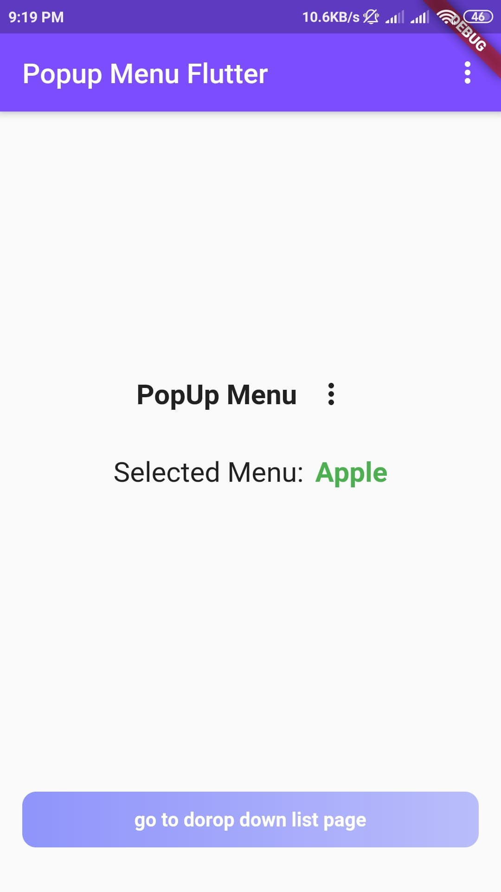
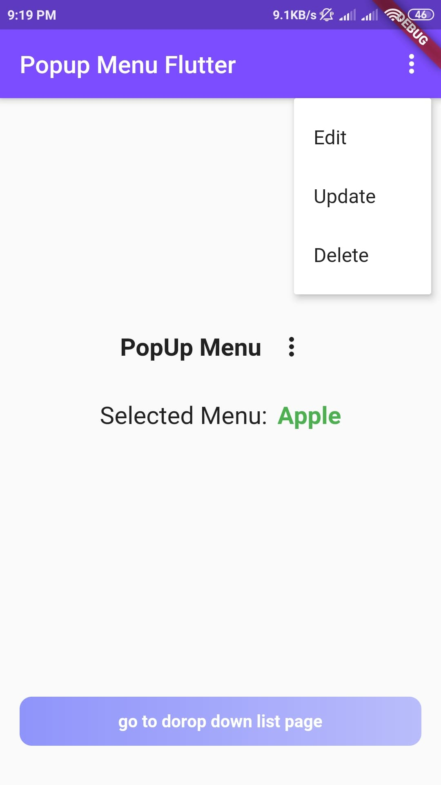
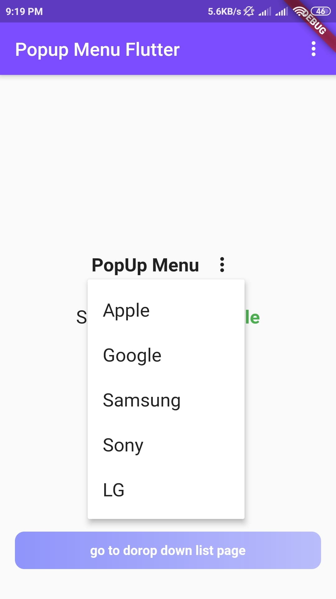
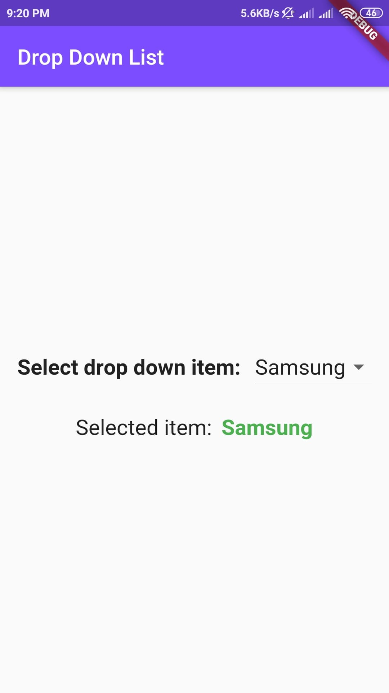
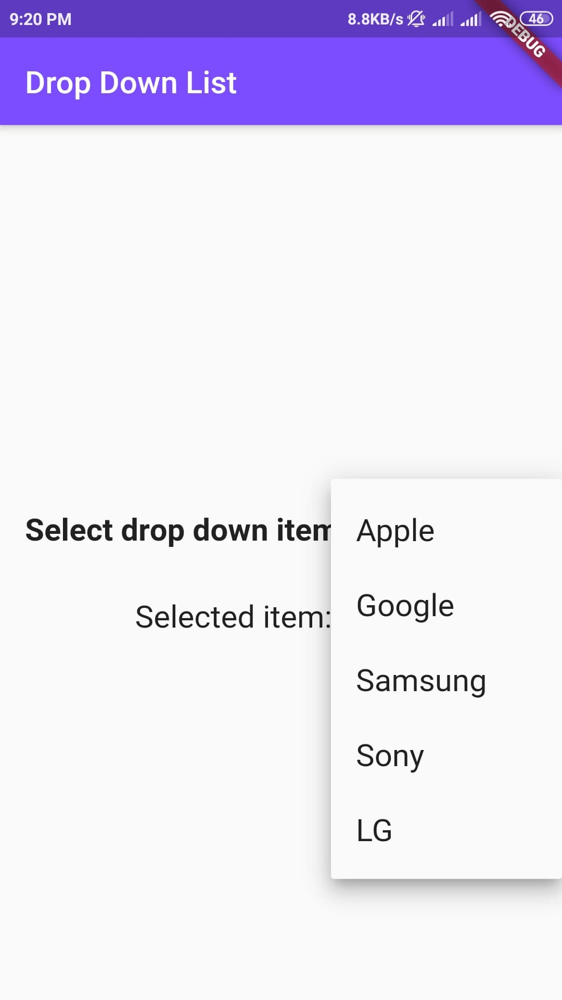

# PopUp Menu & DropDown Menu 

This project is for learning how to use custom popup menu and custom dropdown menu in Flutter App.

### Features:
   - Default Popup
   - Dynamic Popup
   - Dynamic Dropdown
 
## Screenshots
 &nbsp;&nbsp;&nbsp;&nbsp;&nbsp;&nbsp;&nbsp;&nbsp;&nbsp;&nbsp; &nbsp;&nbsp;&nbsp;&nbsp;&nbsp;&nbsp;&nbsp;&nbsp;&nbsp;&nbsp; 

 &nbsp;&nbsp;&nbsp;&nbsp;&nbsp;&nbsp;&nbsp;&nbsp;&nbsp;&nbsp; 